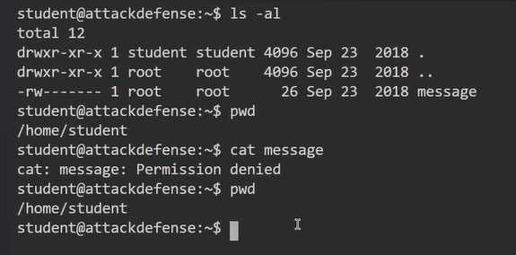
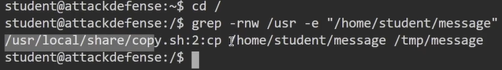
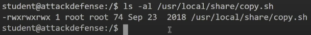
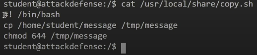
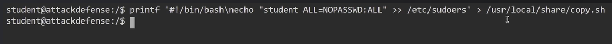
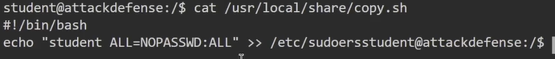
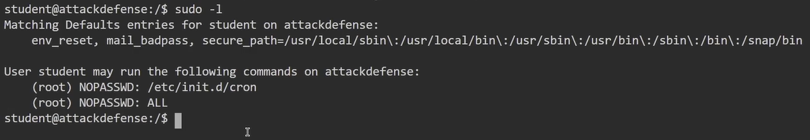
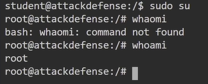

# Misconfigured Cron Jobs

## Explanation

- Linux implements task scheduling through a utility called Cron.

- Cron is a time-based service that runs applications, scripts and other commands repeatdly on a specified schedule.

- An application, or script that has been configured to be run repeatedly with Cron is known as a Cron job. Cron can be used to automate or repeat a wide variety of functions on a system, from daily backups to system upgrades and patches.

- The crontab file is a configuration file that is used by the Cron utility to store and track Cron jobs that have been created.

- Cron jobs can also be run as any user on the system, this is a very important factor to keep an eye on as we will be targeting Cron jobs that have been configured to be run as the "root" user.

- This is primarily because, any script or command that is run by a Cron job will run as root user and will consequently provide us with root access.

- In order to elevate our privileges, we will need to find and identify cron jobs scheduled by the root user or the files being processed by the cron job.

## Technics

1. Identify cron jobs created by the current user :
```
crontab -l
```

2. In our context, the user hasn't created any cron jobs, but a "message" file is present in his home directory, with root rights :



3. Let's go back to the root, and check for shell scripts calling the /home/student/message occurrence : 
```
grep -rnw /usr -e "/home/student/message"
```


4. Let's check the rights associated with the copy.sh script :



5. Here are the contents of the script :



6. We'll try to add a line to this script with the printf command :



7. As a result of the new script content, we have added our current user to the sudoers file :





8. So we can elevate our privileges :

