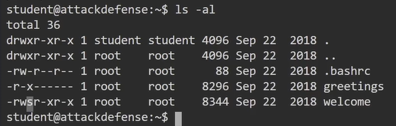
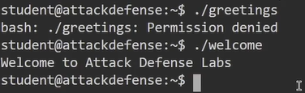
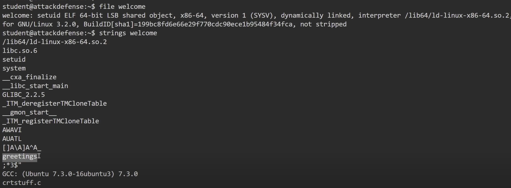
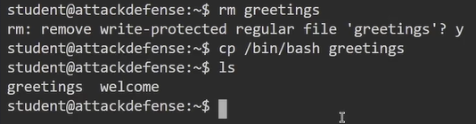
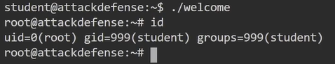

# SUID Binaries

## Explanation

- In addition to the three main file access permissions (read, write and execute), Linux also provides users with specialized permissions that can be utilized in specific situations. One of these access permissions is the SUID (Set Owner User ID) permission.

- When applied, this permission provides users with the ability to execute a script or binary with the permissions of the file owner as opposed to the user that is runnning the script or binary.

- SUID permissions are typically used to provide unprivileged users with the ability to run specific scripts or binaries with "root" permissions. It is to be noted, however, that the provision of elevate privileges is limited to the execution of the script and does not translate to elevation of privileges, however, if improperly configured unprivileged users can exploit misconfigurations or vulnerabilities within the binary or script to obtain an elevated session.

- This is the functionality that we will be attempting to exploit in order to elevate our privileges, however, the success of our attack will depend on the following factors :
    - Owner of the SUID binary : Given that we are attempting to elevate our privileges, we will only be exploiting SUID binaries that are owned by the "root" user or other privileged users.
    - Access permissions : We will require executable permissions in order to execute the SUID binary.

## Technics

1. In our context, the account owns the "greetings" and "welcome" files, however, the file is special because it holds a SUID ("s") permission :

2. We can therefore execute the "welcome" file, but not the other "greetings" file :

3. We can then extract the displayable characters from the "welcome" binary on the console :

4. The "welcome" binary calls on the "greetings" file during execution, so we will delete this file and transform it into a bash binary :

5. Finally, we execute the "welcome" binary again, and we have successfully elevated our privilege :

