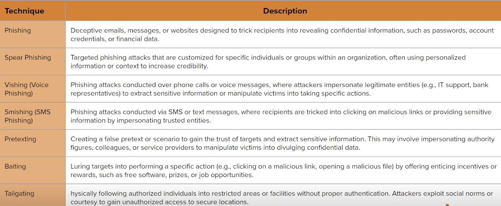

# Introduction To Social Engineering

## What is Social Engineering ?

- In the context of penetration testing and red teaming, social enginerring is a technique used to manipulate individuals or employees within an organization to gain unauthorized access to sensitive information, systems, or facilities.

- It exploits human psychology, trust, and vulnerabilities to deceive targets into performing actions that compromise security, either through information disclosure or by performing specific actions that may seem innocuous at first glance.

- Social engineering attacks aim to bypass technical controls by targeting the weakest link in the security chain: the human element.

- The premise of social engineering is to exploit the human element, in other words, putting people or employees in situations where they will rely on their base instincts and most common forms of social interaction like :
  - The desire to be helpful
  - The tendency to trust people
  - The desire for approval
  - The fear of getting in trouble
  - Avoiding conflict or arguments

- By preying on the human element of system access, most times, attackers do not have to navigate around the security perimeter of an organization.

- Attackers/Pentesters just need to engage with employees inside the compagny to do their bidding for them.

- Instead of spending countless hours trying to infiltrate systems/networks through traditional server-side attacks like brute-force attacks, attackers can leverage social engineering to yield information or facilitate the execution of malware inside the compagny network in a matter of minutes.

## Social Engineering & Social Media

- The advent and adoption of Social Networking as a form of communication has vastly improved the ability and effectiveness of attackers (likewise pentesters) to perform social engineering attacks as employees/targets can be easily contacted by anyone in the world with ease.

- Furthermore, Social Networks have also led to the rise of employees advertently/inadvertently exposing a lot of private information that can be used by attackers in aid of their social engineering attacks (Emails, phone numbers, addresses, etc).

## History of Social Engineering

- While many cybersecurity professionals think of social engineering as a technique exclusive to offensive security, that couldn't be farther from the truth.

- Social engineering is a practice that is as old as time. As long as there has been coveted information, there have been people seeking to exploit it.

- The term social engineering was first coined by Dutch industrialist J.C. Van Marken in 1894. Van Marken suggested that specialists were needed to attend to human challenges in addition to technical ones.

- Social Engineering was defined as a way to encourage people to handle social relations similary to how they approach machines/mechanical systems.

## Social Engineering & Pentesting

- While social engineering has been a very viable attack vector for attackers, it has often been overlooked by penetration testers until recently.

- Contextualizing and operationalizing social engineering as a valid attack vector in penetration testing is a vital skill set to possess as a modern penetration tester.

- In penetration testing and red teaming exercises, phishing simulations are valuable for assessing an organization's susceptibility to social engineering attacks and identifying areas for improvement in security awareness and controls.

## Type of Social Engineering

### Phishing

- Phishing is one of the most prevalent and effective social engineering attacks used in penetration testing and red teaming. It typically involves the following steps :
    1. **Planning & Reconnaissance** : Attackers research the target organization to identify potential targets, gather information about employees, and understand the organization's communication channels and protocols.

    2. **Message Crafting** : Attackers create deceptive emails or messages designed to mimic legitimate communications from trusted sources, such as colleagues, IT departments, or financial institutions. These messages often include urgent or compelling language to evoke a sense of urgency or fear.

    3. **Delivery** : Attackers send phishing emails or messages to targeted individuals within the organization, using techniques to bypass spam filters and security controls. They may also leverage social engineering tactics to increase the likelihood of recipients opening the messages.

    4. **Deception & Manipulation** : The phishing messages contain malicious links, attachements, or requests for sensitive information. Recipients are deceived into clicking on links, downloading attachments, or providing login credentials under false pretenses.

### Spear-Phishing

- Spear phishing is a targeted from phishing attack that tailors malicious emails or messages to specific individuals or groups within an organization.

- Unlike traditional phishing attacks, which cast a wide net and aim to deceive as many recipients as possible, spear phishing attacks are highly personalized and customized to exploit the unique characteristics, interests, and relationships of the intended targets.

### Spear-Phishing Process

1. **Target Selection & Research** :
    - Attackers carefully select their targets based on specific criteria, such as job roles, departments, or organizational hierarchies.
    - Extensive reconnaissance is conducted to gather information about the targets, including names, job titles, roles, responsibilities, work relationships, and personal interests.
    - Publicly available sources, social media profiles, corporate directories, and leaked data may be mined to compile detailed profiles of the targets.
2. **Message Tailoring** :
    - Using the gathered information, attackers craft highly personalized and convincing emails or messages designed to appear legitimate and trustworthy.
    - The content of the messages may reference recent events, projetcs, or activities relevant to the target's role or interests to enhance cedibility.
    - Attackers may impersonate trusted individuals, such as colleagues, supervisors, or external partners, to increase the likelihood of the targets opening the messages and taking the desired actions.
3. **Delivery** :
    - Spear phishing messages are delivered to the targeted individuals via email, social media, instant messaging platforms, or other communication channels.
    - Attackers employ tactics to bypass email security filters and anti-phishing mechanisms, such as using compromised or spoofed email accounts, exploiting zero-day vulnerabilities, or leverating trusted third-party services.
